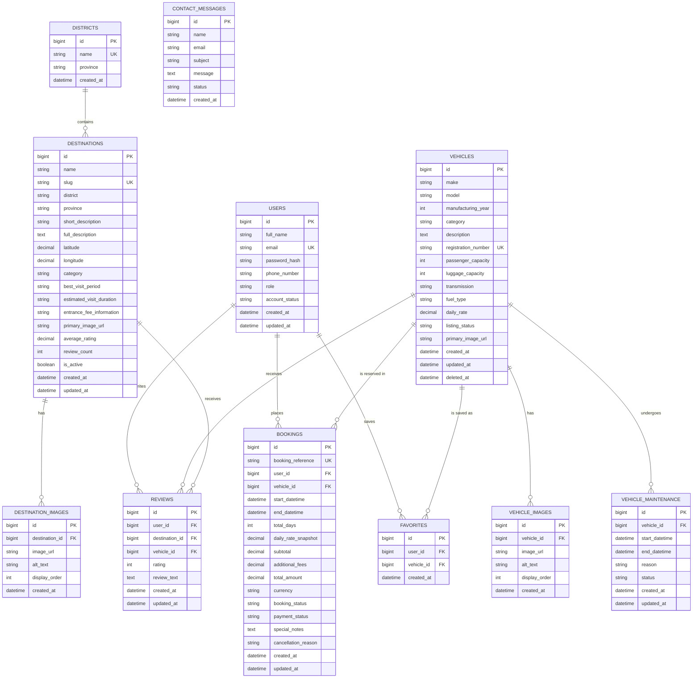

# TourLynk Database Entity Relationship Diagram (ERD)

```mermaid
erDiagram
    USERS ||--o{ BOOKINGS : "places"
    USERS ||--o{ REVIEWS : "writes"
    USERS ||--o{ FAVORITES : "saves"
    VEHICLES ||--o{ BOOKINGS : "is reserved in"
    VEHICLES ||--o{ VEHICLE_IMAGES : "has"
    VEHICLES ||--o{ REVIEWS : "receives"
    VEHICLES ||--o{ FAVORITES : "is saved as"
    VEHICLES ||--o{ VEHICLE_MAINTENANCE : "undergoes"
    DESTINATIONS ||--o{ DESTINATION_IMAGES : "has"
    DESTINATIONS ||--o{ REVIEWS : "receives"
    DISTRICTS ||--o{ DESTINATIONS : "contains"

    USERS {
        bigint id PK
        string full_name
        string email UK
        string password_hash
        string phone_number
        string role
        string account_status
        datetime created_at
        datetime updated_at
    }

    VEHICLES {
        bigint id PK
        string make
        string model
        int manufacturing_year
        string category
        text description
        string registration_number UK
        int passenger_capacity
        int luggage_capacity
        string transmission
        string fuel_type
        decimal daily_rate
        string listing_status
        string primary_image_url
        datetime created_at
        datetime updated_at
        datetime deleted_at
    }

    VEHICLE_IMAGES {
        bigint id PK
        bigint vehicle_id FK
        string image_url
        string alt_text
        int display_order
        datetime created_at
    }

    DISTRICTS {
        bigint id PK
        string name UK
        string province
        datetime created_at
    }

    DESTINATIONS {
        bigint id PK
        string name
        string slug UK
        string district
        string province
        string short_description
        text full_description
        decimal latitude
        decimal longitude
        string category
        string best_visit_period
        string estimated_visit_duration
        string entrance_fee_information
        string primary_image_url
        decimal average_rating
        int review_count
        boolean is_active
        datetime created_at
        datetime updated_at
    }

    DESTINATION_IMAGES {
        bigint id PK
        bigint destination_id FK
        string image_url
        string alt_text
        int display_order
        datetime created_at
    }

    BOOKINGS {
        bigint id PK
        string booking_reference UK
        bigint user_id FK
        bigint vehicle_id FK
        datetime start_datetime
        datetime end_datetime
        int total_days
        decimal daily_rate_snapshot
        decimal subtotal
        decimal additional_fees
        decimal total_amount
        string currency
        string booking_status
        string payment_status
        text special_notes
        string cancellation_reason
        datetime created_at
        datetime updated_at
    }

    REVIEWS {
        bigint id PK
        bigint user_id FK
        bigint destination_id FK
        bigint vehicle_id FK
        int rating
        text review_text
        datetime created_at
        datetime updated_at
    }

    FAVORITES {
        bigint id PK
        bigint user_id FK
        bigint vehicle_id FK
        datetime created_at
    }

    VEHICLE_MAINTENANCE {
        bigint id PK
        bigint vehicle_id FK
        datetime start_datetime
        datetime end_datetime
        string reason
        string status
        datetime created_at
        datetime updated_at
    }

    CONTACT_MESSAGES {
        bigint id PK
        string name
        string email
        string subject
        text message
        string status
        datetime created_at
    }
```

